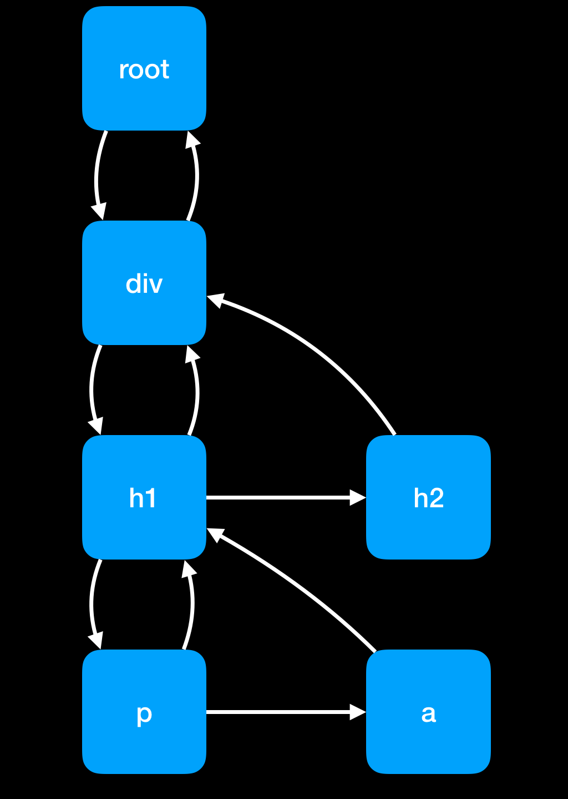
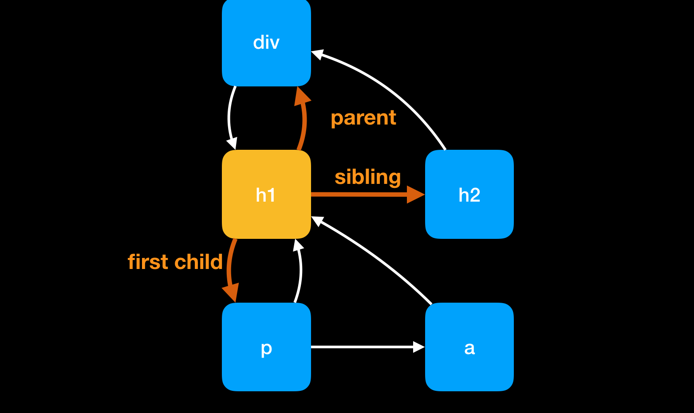
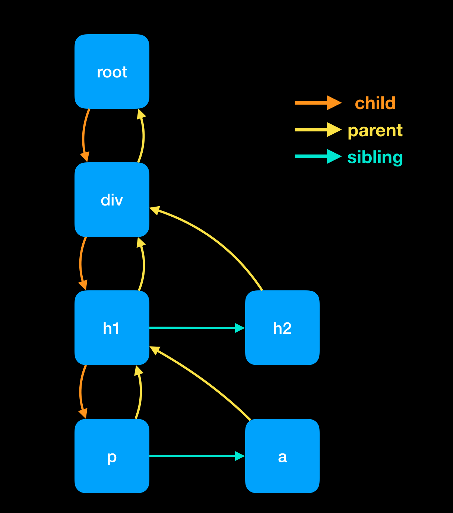
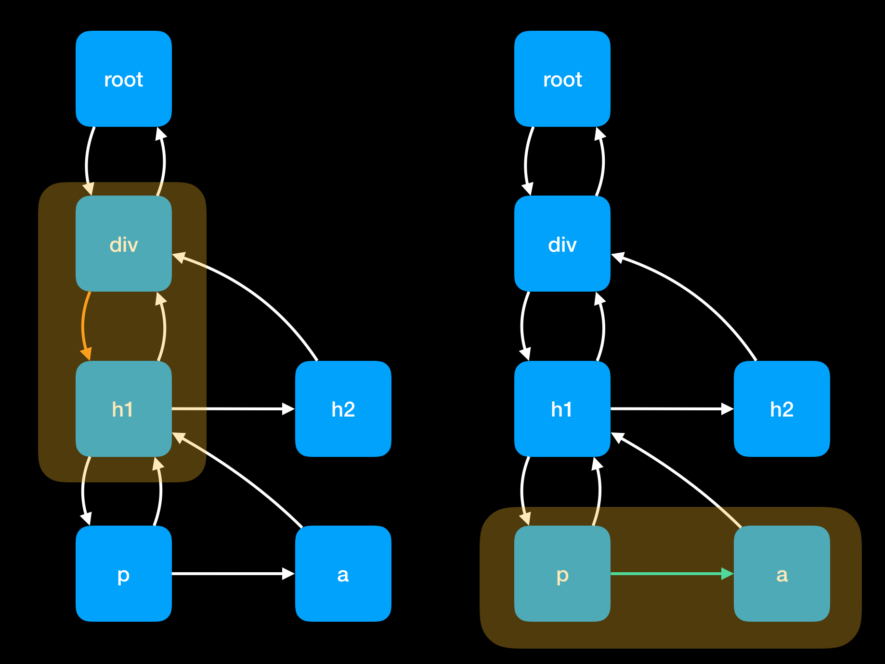

### 同步模式(Concurrent Mode)

一旦我们开始渲染，就不会停止，直到将整个 DOM 渲染完成。如果 DOM 元素树很大，因为 js 引擎和 DOM 引擎都运行在主线程上，可能会阻塞主线程太长时间。这样就会影响到浏览器去处理一些高优先级的事情，比如处理用户输入或保持动画的流畅性，将不得不都等到渲染结束。

可以要把工作分成几个小任务单元，在完成每个任务单元后，还有什么需要做的，会让浏览器中断渲染。

使用 `requestIdleCallback` 来做一个循环。暂时简单地把 `requestIdleCallback` 看作是 `setTimeout`，不同的是我们不需要告诉requestIdleCallback何时运行，浏览器在主线程空闲时会自动运行 requestIdleCallback 回调。

现在 React 不再使用 `requestIdleCallback`了。现在使用调度器包，但对于这个用例来说，仅是为了说明一些概念，所以为了简化就暂时还采用 requestIdleCallback。

requestIdleCallback 为回调函数提供了一个 deadline 参数。可以用 deadline 这个参数来检查在浏览器剩余空闲时间还有多少。

截至 2019 年 11 月，并发模式在 React 中还不稳定。稳定版本的循环看起来更像这样。要开始使用这个循环，我们需要设置第一个工作单位，然后写一个 performUnitOfWork 函数，不仅要执行工作，还要返回下一个工作单位。

```js
function workLoop(deadline){
    //
    let shouldYield = false
    // 循环条件是还有要执行的任务并且空闲时间不为 0 
    while( nextUnitOfWork && !shouldYield){
        // 执行任务单元后，并返回一个任务单元
        nextUnitOfWork = performUnitOfWork(
            nextUnitOfWork
        )
        // 如果没有剩余时间则将 shouldYield = true 就将推出循环
        shouldYield = deadline.timeRemaining() < 1
    }
    // 
    requestIdleCallback(workLoop)

    
}
```
```js
requestIdleCallback(workLoop)
function performUnitOfWork(nextUnitOfWork){
        //TODO
}
```


### fiber
React 团队用 fiber 的数据结构重构，fiber 作为任务最小单元，也就是我们大的任务拆分为一个一个小任务，每一个小任务就是一个 fiber ，这些小任务以树结构组织在一起就是 fiber tree。
fiber 被设计成对应一个虚拟节点，每一个 fiber 又是一个任务单元。

```js

miniReact.render(
  <div>
    <h1>
      <p/>
      <a/>
    <h1>
    <h2/>
  </div>
)
```

在 `render` 方法中，将创建一个根 fiber 结点，并且将该结点设置为 `nextUnitOfWork` 。接下来就是 `performUnitOfWork` 登场了，每个 fiber 任务单元通常都会做以下几件事

- 将一个元素添加 DOM 节点
- 为改元素的子节点创建其对应的 fibers
- 返回下一个要执行的任务单元



通过这种数据结构组织 fiber 的好处就是便于在这样数据结构搜索下一个任务单元。从图上来看每个 fiber 连接到其第一个子结点、以及兄弟结点，还有其父结点。




在结构树上，搜索顺序是如果该结点有 child 结点，这优先 child 结点如下，当 div 所对应 fiber 完成后，这将去完成 h1 fiber 任务。那么如何当前 fiber 结点没有 child 结点，则选择 sibling 作为下一个任务。例如 p fiber 执行完成后因为 p fiber 没有 child 结点，所以就去执行 slibing 结点 a fiber。



那么如果对于一个既没有 child 也没有 sibling 的结点，就只好找该结点的"uncle" 结点，例如 a 和 h2 fibers 这两个结点


同时如果该 parent 结点没有 sibling,这继续向上回溯到一个有 sibling 的结点，或者一直回溯到根结点。当回答根结点也就是意味着这一次更新渲染介绍。


```js
function createDom(fiber){
    const dom = element.type == "TEXT_ELEMENT"
        ? document.createTextNode("")
        : document.createElement(element.type);

    const isProperty = key => key != "children"
    Object.keys(element.props)
        .filter(isProperty)
        .forEach(name => {
            dom[name] = fiber.props[name]
        });

    return dom
}

function render(element, container){
    //TODO set next unit of work
}
let nextUnitOfWork = null
```
- 判断元素类型，根据不同类型创建不同的类型 DOM 结点，文本结点或 DOM 结点
- 从 `props` 中筛选出不是 `children` 的属性
- 然后为创建好的 DOM 设置属性

`createDom` 根据 fiber 信息生成一个 DOM 结点，

```js
function render(element, container){
    //TODO set next unit of work
    nextUnitOfWork = {
        dom:container,
        props:{
            children: [element]
        },
    }
}
```
这里 `render` 方法将`nextUnitOfWork`设置到 fiber 树根结点。

当浏览器准备好了开始调用 `workLoop` 方法，`workLoop` 会先从 fiber 根结点开始

```js
function performUnitOfWork(fiber){
  //添加 dom 结点
  //创建一个 fibers
  //返回一个任务单元
}
```
- 将一个元素添加 DOM 节点
- 为改元素的子节点创建其对应的 fibers
- 返回下一个要执行的任务单元

```js
function performUnitOfWork(fiber){
    if(!fiber.dom){
        fiber.dom = createDom(fiber)
    }

    if(!fiber.parent){
        fiber.parent.dom.appendChild(fiber.dom)
    }
}
```
首先创建一个 dom 结点并且添加到 DOM 树

```js
const elements = fiber.props.children;
let index = 0;
let prevSibling = null;

while (index < elements.length){
    const element = elements[index]
    const newFiber = {
        type: element.type,
        props: element.props,
        parent: fiber,
        dom: null,
    }
}
```
对于每个 child 为其创建一个新的 fiber。

```js
const elements = fiber.props.children;
let index = 0;
let prevSibling = null;

while (index < elements.length){
    const element = elements[index]
    const newFiber = {
        type: element.type,
        props: element.props,
        parent: fiber,
        dom: null,
    }

    if(index === 0){
        fiber.child = newFiber
    }else{
        prevSibling.sibling = newFiber
    }

    prevSibling = newFiber;
    index++
}
```

如果 child 是第一个 child，则作为 child 添加到当前 fiber ，如果 child 并非是当前结点的第一个 child 做作为 child 或者当前 prevSibling 的 sibling

```js
if(fiber.child){
    return fiber.child
}
let nextFiber = fiber
while(nextFiber){
    if (nextFiber.sibling){
        return nextFiber.sibling
    }
    nextFiber = nextFiber.parent
}
```
这一段代码根据搜索优先级，如果当前 fiber 有 child 则返回 fiber.child 做下一个要执行任务单元。如果没有 child 则优先 sibling 

### 渲染和提交(Render and Commit)

用 fiber 的概念渲染整棵树的任务分解为元素级别的任务，每一个任务仅对一个元素进行处理时，然后就会向 DOM 添加一个新的节点。而且，在我们完成整个树的渲染之前，浏览器可能会中断我们的工作。在这种情况下，用户将看到一个不完整的用户界面。而我们并不希望如此。

因此我们可以暂时将变化的部分隐藏起来

```js
function performUnitOfWork(fiber){
    if(!fiber.dom){
        fiber.dom = createDom(fiber)
    }

    // if(!fiber.parent){
    //     fiber.parent.dom.appendChild(fiber.dom)
    // }
```

相反，我们将跟踪 fiber tree 的根结点。工作进展根或 wipRoot。

```js
function render(element, container){
    //TODO set next unit of work
    wipRoot = {
        dom:container,
        props:{
            children: [element]
        },
    }
    nextUnitOfWork = wipRoot
}


let nextUnitOfWork = null;
let wipRoot = null;
```


```js
function commitRoot(){
    //TODO add nodes to dom
}

function render(element, container){
    //TODO set next unit of work
    wipRoot = {
        dom:container,
        props:{
            children: [element]
        },
    }
    nextUnitOfWork = wipRoot
}


let nextUnitOfWork = null;
let wipRoot = null;

function workLoop(deadline){

    let shouldYield = false
    while( nextUnitOfWork && !shouldYield){
        nextUnitOfWork = performUnitOfWork(
            nextUnitOfWork
        )

        shouldYield = deadline.timeRemaining() < 1
    }
    // 

    if(!nextUnitOfWork && wipRoot){
        commitRoot();
    }
    requestIdleCallback(workLoop)

}
```


一旦我们完成了所有的构建 dom 结点的工作，也就是因为没有下一个工作单元)，就把整个 fiber tree 提交到 DOM 上。将 fiber tree 渲染到 DOM 树上工作交给 commitRoot 函数去做，通过递归形式将所有的节点添加到 DOM 中。