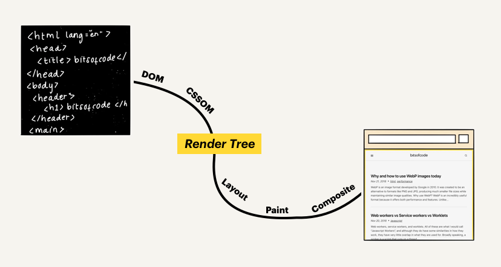

frame work component vs web component

#### framework componet

- binding
- change detection
- State management
- Routing

#### web component

- lightweight
- Flexible
- No framework
- Share component between diferent frameworks
- components seperate from frameworks

#### custom elements


## Web Compoent 系列—shadow DOM(1)

> Shadow DOM 是三种 Web compoent 标准之一。**HTML Templates**、**Shadow DOM** 和 **Custom Elements**

#### shadow DOM


有关于 HTML、CSS 和 JS  都具有全局性，如果稍不小心之前定义好的内容就可能被覆盖，特别是 CSS，为此在设计层面，或者编码规范层面上花费学多心思来解决这些命名冲突的问题，但是只要稍不留神(特别是 CSS)就容易造成问题，这一点我想每个写过 web 的研发人员一定深度体会，只能靠经验一点一点排查和解决。样式选择器逐渐失去了控制，性能也会受到影响。这样的例子不胜枚举。


Shadow DOM 的出现从根本上解决了这些问题。为网络平台引入了范围化的样式。在没有工具或命名规则的情况下，你可以将CSS与标记捆绑在一起，隐藏实现细节，并在`vanilla JavaScript`中编写独立的组件。


Web components 的一个重要属性是封装——可以将标记结构、样式和行为隐藏起来，并与页面上的其他代码相隔离，保证不同的部分不会混在一起，可使代码更加干净、整洁。


Shadow DOM 是三种 Web compoent 标准之一。**HTML Templates**、**Shadow DOM** 和 **Custom Elements**。**HTML Import** 曾经是其中的一部分，但现在被认为是被**废弃(deprecated)**的。


当然创建 Web Components 时并没有强制必须编写 shadow DOM，但是如果在定义 Web component 如何引入 shadow DOM，那么 shadow DOM 就会给你带来一个大礼包，CSS 的作用域、DOM封装以及组合。这样做的好处不言而喻，让自定义组件具有一定灵活性、和重用性高。


使用 Custom Elements 来 JS API 方式来创建 HTML，而 shadow DOM 为 HTML 提供了 HTML 和 CSS 。这两个 API 结合在一起，使一个组件具有自己的空间，独立的 HTML、CSS和 JavaScript。

Shadow DOM被设计为构建基于组件的应用程序的工具。因此，它为网页开发中的常见问题带来了解决方案。

- 隔离的 DOM(**Isolated DOM**):  一个组件的 DOM 是隔离，无法通过 document.querySelector() 获取组件的shadow DOM 中的结点
- 具有作用域的 CSS(**Scoped CSS**): 在 shadow DOM 内的 CSS 是具有自己定义域。这里 CSS 样式规则不会影响到以外样式，而且外面 CSS 也不会影响到 shadow DOM 里的元素
- 组成(**Composition**:):为组件设计一个声明式的、基于标记的API
- 简化 CSS(**Simplifies CSS**) - 带有作用域的 DOM 中，就不会为了避免冲突而定义繁琐的 id/class 名称，不必为命名冲突而担心
- 生产力(**Productivity**)—把应用程序放在 DOM 的块，省去了那些为了避免覆盖和冲突而花费的时间


### 什么是 shadow DOM？
#### 关于DOM的背景

如果 HTML 算是语言的话，我接触第一门语言就是 HTML，HTML 的简单和易于操作推动 web 发展，只需要简单地声明一些标签(tag)，就可以编写一个既有表现力又有结构的页面。然而 HTML 作为基于文本的语言设计初衷便于人类理解，但机器需要更多的东西，得到一个**文档对象模型**，或称 DOM。



#### 页面加载过程

当浏览器加载一个网页时，会发生一系列有趣的事。所做的事情之一是将作者的 HTML 转化为一个文档对象模型(DOM)，这个文档对象模型并不是静态。浏览器将 HTML (静态的文本字符串解析为数据模型(对象/节点) ，也就是将解析页面的结构。解析后得到的树型数据结构可以保留 HTML 层次，这个树型数据结构也就是我们熟悉的 DOM。DOM 最酷的地方在于是动态的，这一点与静态 HTML 不同之处。动态体现在可以用 Javascript 来随意操作这个 DOM。


```html
<!DOCTYPE html>
<html lang="en">
<head>
    <meta charset="UTF-8">
    <meta http-equiv="X-UA-Compatible" content="IE=edge">
    <meta name="viewport" content="width=device-width, initial-scale=1.0">
    <title>Document</title>
</head>
<body>
    <script>
        const header = document.createElement('header');
        const h1 = document.createElement('h1');
        h1.textContent = 'Hello DOM';
        header.appendChild(h1);
        document.body.appendChild(header);
    </script>
</body>
</html>
```


```html
<body>
  <header>
    <h1>Hello DOM</h1>
  </header>
</body>
```


### DOM，怎么理解 shadow 的在阴影下

Shadow DOM 只是普通的 DOM，不过与普通 DOM 有两个不同之处

- 创建/使用方式不同

- shadow DOM 与页面其他部分的交互方式也不同

一般情况，当创建 DOM 节点后，然后将其添加一个 DOM 元素，同时可以为其添加一个子结点。而在 shadow DOM 中，其实创建了一个具有作用域 DOM 树，然后将其添加一个元素上，实际上这个 DOM 与父结点间的关系不大。这个作用域的子树称为 shadow tree。shadow 添加到元素是 shadow host， shadow host 是 DOM 元素。在 shadow DOM 下添加任何结点都是和外界隔离具有自己空间，包括 `<style>`，这里 CSS 仅是作用域 shadow DOM 的样式。


- Shadow host：一个常规 DOM节点，Shadow DOM 会被附加到这个节点上。
- Shadow tree：Shadow DOM内部的DOM树。
- Shadow boundary：Shadow DOM结束的地方，也是常规 DOM开始的地方。
- Shadow root: Shadow tree 的根节点。


> 注意，其实 Shadow DOM 也不是什么新事物，在过去的很长一段时间里，浏览器用 shadow DOM 由济宁来封装一些元素的内部结构。以一个有着默认播放控制按钮的`<video>`元素为例。你所能看到的只是一个 `<video>` 标签，其实这就是 shadow DOM


#### 创建 shadow DOM

可以使用  `Element.attachShadow()` 来将创建好 shadow root 附加到一个 DOM 元素上。这个方法接受一个配置对象作为参数，该对象有一个 `mode` 属性，值可以是 `open` 或者 `closed`：

> mode 是 ShadowRoot  的只读属性，返回 ShadowRoot 创建时的模式 ("open" 或者 "closed") 。当 ShadowRoot 的 mode 是 "closed" 时， ShadowRoot 的内部实现无法被 JavaScript 访问及修改 — 也就是说将该实现不公开，例如，`<video>` 标签内部实现无法被 JavaScript 访问及修改。


```html
<!DOCTYPE html>
<html lang="en">
<head>
    <meta charset="UTF-8">
    <meta http-equiv="X-UA-Compatible" content="IE=edge">
    <meta name="viewport" content="width=device-width, initial-scale=1.0">
    <title>Document</title>
    <style>
        h1 {
            background-color: yellow;
        }
        
    </style>
</head>
<body>
    <div>
        <div id="container"></div>
        <h1>DOM element</h1>
    </div>
    <script>
        (function (){
            var root = container.attachShadow( { mode: "open" } )

            //Inside element
            var h1 = document.createElement( "h1" )
            h1.textContent = "Inside Shadow DOM"
            h1.id = "inside"
            root.appendChild( h1 )

            //Access inside element
            console.log( container.shadowRoot.querySelector( "#inside" ) )
        })()

    </script>
</body>
</html>
```

```js
var root = container.attachShadow( { mode: "open" } )
```
这个代码感觉有点惊讶，对于一个给了`id` 的 div 我们可以直接用 id 来获取 div element，可能是很长时间没碰 web 有点落伍了，为此我还特意试一试。直接在 container 调用 `attachShadow` 会返回一个 shadow root 根元素，然后我们创建的 element 就可以添附到 shadow root 结点上。

```js
var h1 = document.createElement( "h1" )
            h1.textContent = "Inside Shadow DOM"
            h1.id = "inside"
            root.appendChild( h1 )
```


如果你想将一个 Shadow DOM 附加到 custom element 上，可以在 custom element 的构造函数中添加如下实现（目前，这是 shadow DOM 最实用的用法）：

```js
// Use custom elements API v1 to register a new HTML tag and define its JS behavior
// using an ES6 class. Every instance of <fancy-tab> will have this same prototype.
customElements.define('fancy-tabs', class extends HTMLElement {
  constructor() {
    super(); // always call super() first in the constructor.

    // Attach a shadow root to <fancy-tabs>.
    const shadowRoot = this.attachShadow({mode: 'open'});
    shadowRoot.innerHTML = `
      <style>#tabs { ... }</style> <!-- styles are scoped to fancy-tabs! -->
      <div id="tabs">...</div>
      <div id="panels">...</div>
    `;
  }
  ...
});
```


